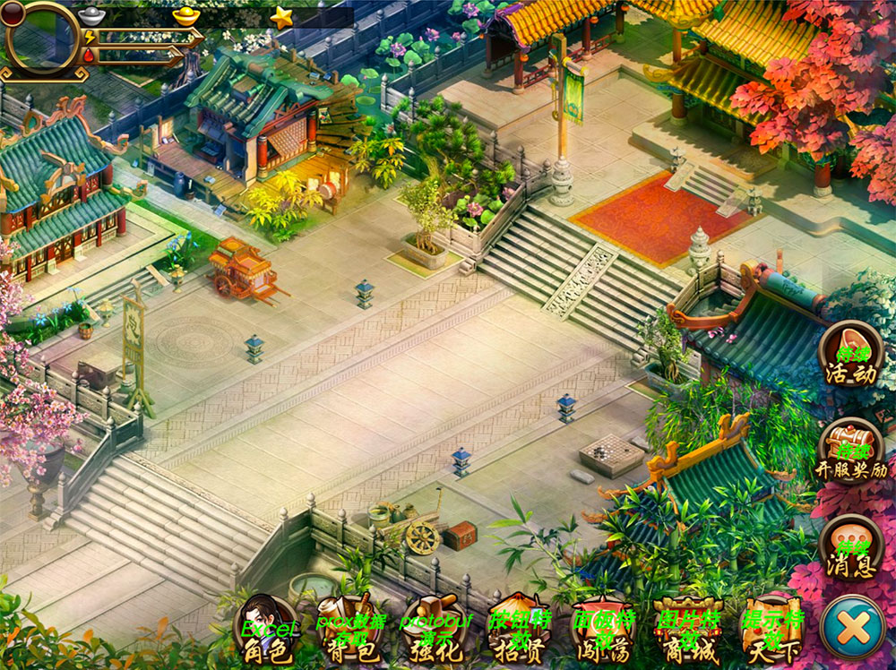

    

    
    
    
    <a href="https://github.com/dily3825002/EgerPro">
        -TypeScript-brightgreen.svg"
             alt="TS">
    </a>

[EN](README.md) / [CN](README_CN.md)

# Eger Pro - HTML5 HTML5 Medium and Severe Game Development Solutions

Eger Pro is based on the development of Egret HTML5 4.x game development solutions. Eger Pro reference to a number of webgame project framework, eliminating the need for the function, to retain the essence of the decoupling mechanism, added a number of features for the HTML5 game. 

### Feature

# Install

First get Egret Engine：

[Download link](https://egret.com/products/engine.html) 

If necessary, you can refer to： 

[HelloWorld](http://developer.egret.com/cn/github/egret-docs/Engine2D/getStarted/helloWorld/index.html) |
[Installation and deployment](http://developer.egret.com/cn/github/egret-docs/Engine2D/projectConfig/installation/index.html) |
[Engine and tool management](http://developer.egret.com/cn/github/egret-docs/Engine2D/projectConfig/launcherManager/index.html) 

After installation, we can easily manage the Egret engine and tools。

In order to facilitate the development can download Egret Wing： 

[Download link](https://egret.com/products/wing.html) 

Eger Pro directly into the Wing or drag into the Wing can be。

# Demos

Click online experience address：[Demo address](http://eger.sinaapp.com/code/egerpro/) 

# Document

## Basic tutorial

* [Origin](http://bbs.egret.com/thread-13953-1-1.html)
* [Structural interpretation](http://bbs.egret.com/forum.php?mod=viewthread&tid=13956&page=1&extra=#pid84088)
* [Use component](http://bbs.egret.com/forum.php?mod=viewthread&tid=13959&page=1&extra=#pid84115)
* [Use config](http://bbs.egret.com/thread-13961-1-1.html)
* [Use constants](http://bbs.egret.com/thread-13963-1-1.html)

## Advanced course

* [What is PureMVC？](http://bbs.egret.com/thread-13967-1-1.html)
* [The use of controller in core](http://bbs.egret.com/forum.php?mod=viewthread&tid=13984&page=1&extra=#pid84300)
* [The use of model in core](http://bbs.egret.com/forum.php?mod=viewthread&tid=13986&page=1&extra=#pid84309)
* [The use of view in core](http://bbs.egret.com/forum.php?mod=viewthread&tid=13987&page=1&extra=#pid84310)
* [Use net](http://bbs.egret.com/forum.php?mod=viewthread&tid=14001&page=1&extra=#pid84446)
* [Use utils](http://bbs.egret.com/forum.php?mod=viewthread&tid=14002&page=1&extra=#pid84447)
* [Use EgerTool Excel export tool](http://bbs.egret.com/forum.php?mod=viewthread&tid=14004&page=1&extra=#pid84450)

## Comprehensive course

* [Eger Pro is how to start up](http://bbs.egret.com/forum.php?mod=viewthread&tid=14005&page=1&extra=#pid84452)

# Tools

* [EgerTool Excel export tool](http://bbs.egret.com/forum.php?mod=viewthread&tid=14004&page=1&extra=#pid84450)：Export Eger Pro can use the data format
* [Eger Pro effects collaboration tool](http://bbs.egret.com/thread-2267-1-1.html)：Eger Pro effects collaboration tool
* [Egret Wing](http://www.egret.com/products/wing.html)：Egret IDE Rapid development of HTML5 games
* [Dragonbones Pro](http://dragonbones.com/cn/index.html)：Egret Skeletal animation tool
* [More tools](http://www.egret.com/products)

# Community

* Eger QQ group：70843223
* [Egret developer community](http://bbs.egret.com)

# Author

* [Dily blog](http://www.dilyblog.com/) 
* [My Weibo](http://weibo.com/1856526021/profile?topnav=1&wvr=6) 

My subscription number《This article is not serious》  
    

# License
This content is released under the (https://opensource.org/licenses/BSD-2-Clause) BSD License.

